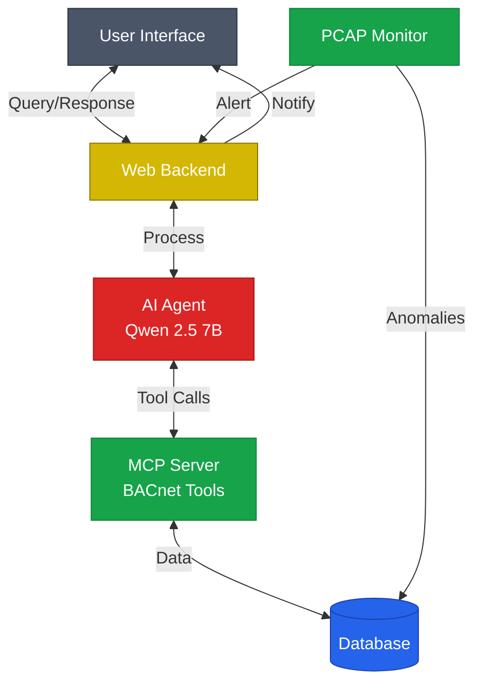
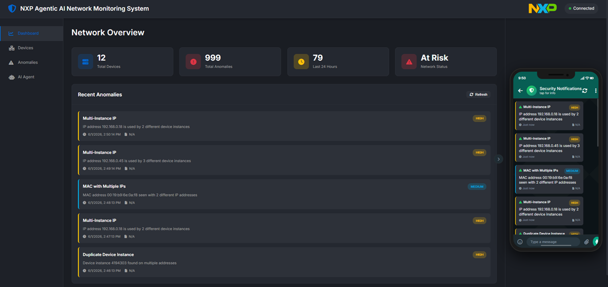

# NXP Application Code Hub
[](https://www.nxp.com)

## i.MX 8M Plus / 95 - Ara240 Agentic Network Management System 

<!----- Boards ----->

[](https://www.nxp.com/FRDM-IMX95) 
[](https://www.nxp.com/FRDM-IMX8MPLUS)
[](https://www.nxp.com/applications/technologies/ai-and-machine-learning:MACHINE-LEARNING)
[](https://mcuxpresso.nxp.com/appcodehub?category=aiml)

[](./LICENSE.txt)
[](https://www.nxp.com/IMXLINUX)

## Introduction
This project demonstrates how to enable an Agent on NXP i.MX edge devices. The demo shows an AI-powered BACnet network management system. The demo combines real-time network monitoring with AI-driven analysis to detect anomalies and provide security insights through natural language interaction.

## Table of Contents
1. [Software](#step1)
2. [Hardware](#step2)
3. [Setup](#step3)
4. [Results](#step4)
5. [FAQs](#step5) 
6. [Support](#step6)
7. [Release Notes](#step7)

## 1. Software<a name="step1"></a>

- Prerequisites
    - [Linux 6.18.2_1.0.0](https://www.nxp.com/IMXLINUX)
    - [Ara Software Development Kit](https://www.nxp.com/design/design-center/software/embedded-software/ara-software-development-kit:ARA-SDK)
    - [eIQ AAF Connector 2.0.0](https://github.com/nxp-imx-support/eiq-aaf-connector)

### 1.1 Software architecture

This demo application adopts the following architecture:

<div align="center">


</div>

### Architecture Components

- **User Interface**: Web dashboard for monitoring and queries
- **Web Backend**: FastAPI server handling requests and WebSocket notifications
- **AI Agent**: Qwen 2.5 7B LLM processing natural language queries
- **MCP Server**: BACnet monitoring tools (devices, anomalies, statistics)
- **PCAP Monitor**: Real-time network traffic analysis and anomaly detection
- **Database**: SQLite storage for devices and anomalies

## 2. Hardware<a name="step2"></a>

- i.MX Board
    - [FRDM-IMX95](https://www.nxp.com/FRDM-IMX95)
    - [FRDM-IMX8MPLUS](https://www.nxp.com/FRDM-IMX8MPLUS)
- [Ara 240 Discrete Neural Processing Unit](https://www.nxp.com/ARA240)

## 3. Setup<a name="step3"></a>

- The connector must be running with [Qwen 2.5 Instruct 7B](https://huggingface.co/nxp/Qwen2.5-7B-Instruct-Ara240) prior execution. Follow *eIQ AAF Connector* for more detail instructions.

- PCAP files are not included in the repository. User must capture their own BACnet traffic, create  `pcap_files/` directory and place `.pcap` files in the `pcap_files/` directory for anomaly detection emulation.

***Note:*** Since multiple terminals are needed,  it is suggested to use ssh connections or terminal multiplexer like tmux.

### 3.1 Install `Ara2 Runtime Package` and `eIQ AAF Connector`

Go to [Ara Software Development Kit](https://www.nxp.com/design/design-center/software/embedded-software/ara-software-development-kit:ARA-SDK). And download the `Ara2 Runtime Package` and `eIQ AAF Connector` packages.

On your board:
```bash
date -s <DATE>
dpkg -i rt-sdk-ara2_2.0.4.deb
reboot

dpkg -i eiq-aaf-connector_2.0_all.deb
systemctl disable eiq-aaf-connector.service

source /usr/share/eiq/aaf-connector/venv/bin/activate
connector --host 0.0.0.0 --port 8080
```


### 3.2 Download the model

The model can be download by: 
```
fetch_models --list
Available models:
nxp/Qwen2.5-7B-Instruct-Ara240
nxp/Qwen2.5-Coder-1.5B-Ara240
nxp/Qwen2.5-VL-7B-Instruct-Ara240
$ fetch_models --repo-id nxp/Qwen2.5-7B-Instruct-Ara240
```

### 3.3 Run the eIQ AAF Connector

1. Install the deb package
2. Set model to enable in server configuration file *server_config.json*

    ```
    vi /usr/share/eiq/aaf-connector/server_config.json 
    ```

    Example
    ```
        ...
        {                                
            "name": "Qwen2.5-7B-Instruct",
            "description": "Qwen2.5 7B Instruct Unimodal model",
            "type": "text",
            "tool_calling": "native",
            "max_prompt_size": 2047, 
            "enabled": true
        },
        ...  
    ```

3. Activate the virtual environment
    ```bash
    source /usr/share/eiq/aaf-connector/venv/bin/activate
    ```
4. Run the connector:
    ```bash
    connector --host 0.0.0.0
    ```
5. Wait util connector is complete:
    ```bash
    INFO:     Application startup complete.
    INFO:     Uvicorn running on http://0.0.0.0:8000 (Press CTRL+C to quit)
    ```

### 3.4 Run Agentic Network Management System 

On another two terminals:
```bash
cd <project>
uv sync
uv run mcp/mcp_server.py
```
```bash
cd <project>
uv run web/backend.py 
```
***Note:*** *uv* is installed at Step 1 when eIQ AAF Connector is installed. If any issue, try installing manually.

### 3.5 Access the Web Dashboard

1. Get the IP address of your board:

    ```bash
    $ ifconfig
    ```
2. Open your browser and navigate to:
    ```bash
    http://<board-ip>:8080
    ```
3. Navigate to the dashboard and start querying the AI agent for network management tasks.

## 4. Results<a name="step4"></a>

When the application is launched in a browser, the dashboard is presented as shown below.



## 5. Support<a name="step5"></a>

Questions regarding the content/correctness of this example can be entered as Issues within this GitHub repository.

>**Warning**: For more general technical questions regarding NXP Microcontrollers and the difference in expected functionality, enter your questions on the [NXP Community Forum](https://community.nxp.com/)

[](https://www.youtube.com/NXP_Semiconductors)
[](https://www.linkedin.com/company/nxp-semiconductors)
[](https://www.facebook.com/nxpsemi/)
[](https://x.com/NXP)

## 6. Release Notes<a name="step6"></a>
| Version | Description / Update                           | Date                        |
|:-------:|------------------------------------------------|----------------------------:|
| 1.0     | Initial release on Application Code Hub        | June 29<sup>th</sup> 2026 |

## Licensing

This repository is licensed under the [BSD-3-Clause](./LICENSE.txt) license.
